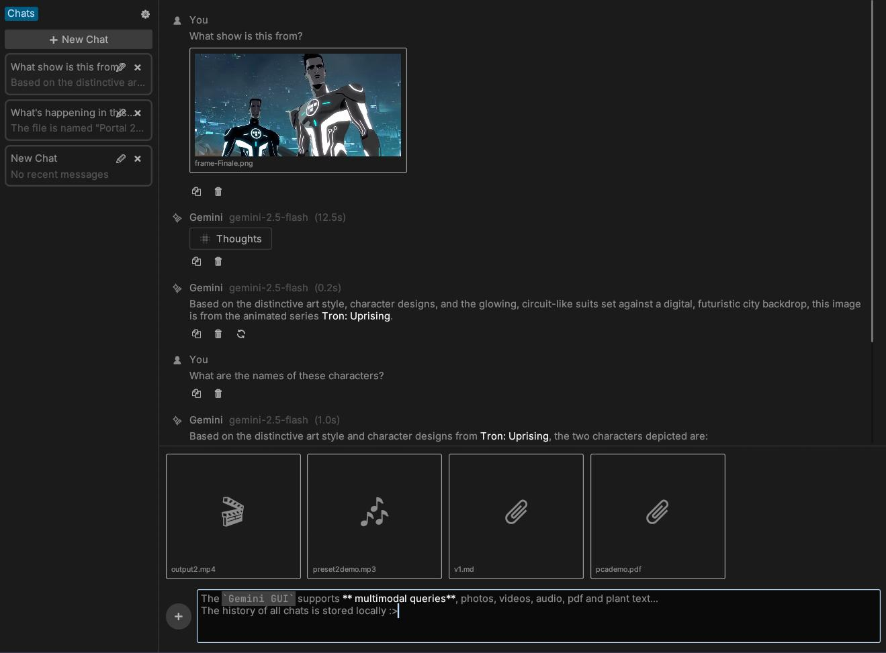
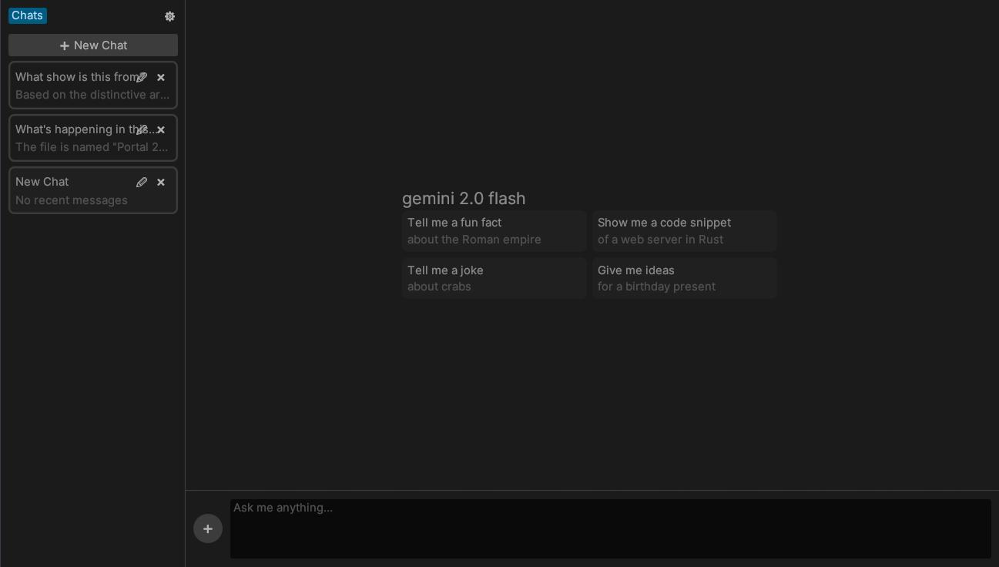
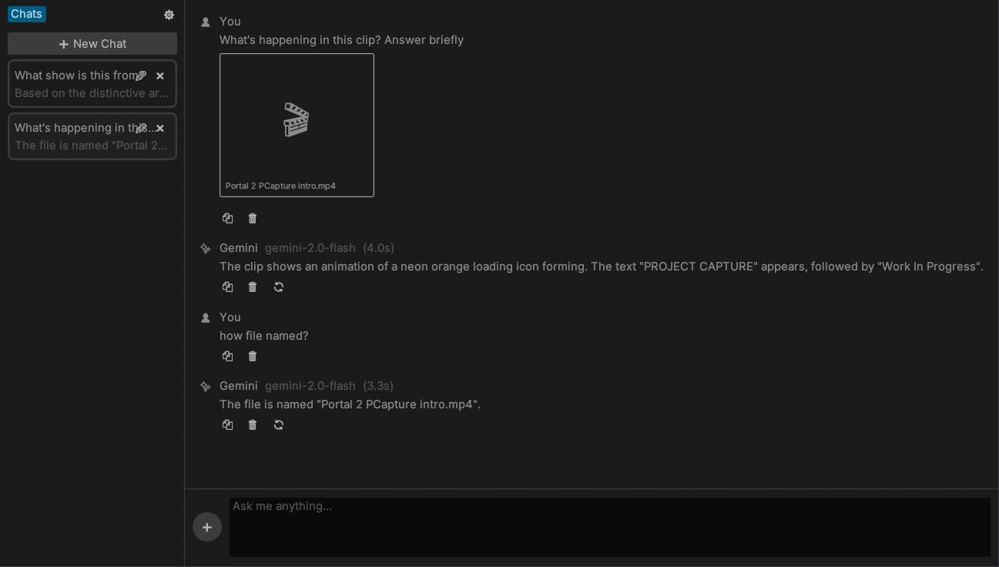
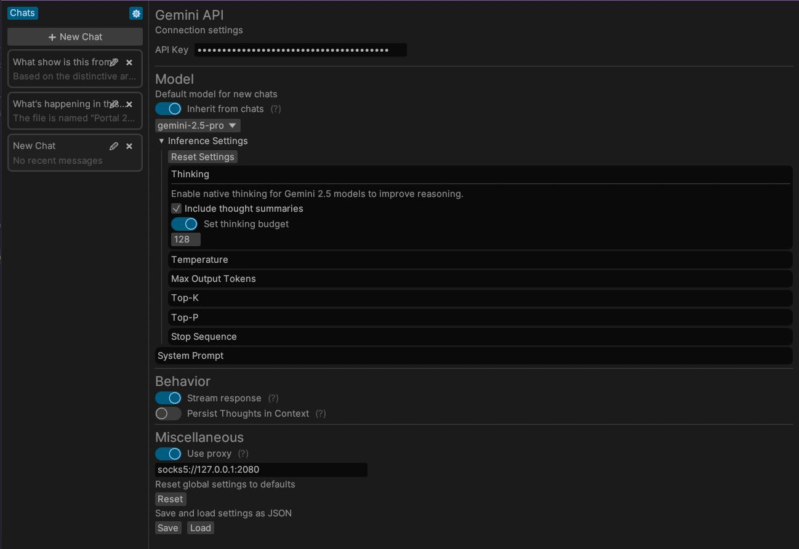

# ✨ Gemini eGUI

A powerful, feature-rich desktop client for Google's Gemini Models.

Gemini GUI is a user-friendly interface to chat with Google's powerful Gemini models directly from your desktop. Forked from the excellent [Ellama](https://github.com/zeozeozeo/ellama) project, it swaps the Ollama backend for the official Gemini API and introduces significant UI/UX enhancements.

# Features

- **Direct Gemini API Integration**: No need for local inference engines. Just bring your own Google AI Studio API key and start chatting.
- **Full Multimodality**: Leverage the vision capabilities of Gemini. Effortlessly chat about images, audio, videos, and documents by simply dropping them into the app.
- **Advanced Model Control**: Fine-tune your experience with detailed settings for each chat, including temperature, Top-P, Top-K, system prompts, and enabling Gemini's native "thinking" process for improved reasoning.
- **Complete Chat History**: Create, delete, and edit model settings on a per-chat basis. Your conversations are saved locally for you to continue anytime.
- **Resource Efficient**: Built with Rust and `egui`, the application has minimal RAM and CPU usage, ensuring a smooth experience.
- **Your API Key, Your Data**: Your conversations go directly to the Google API using your key. There are no intermediary servers or subscriptions.

# Quickstart

1.  Download the latest release from the **[Releases](https://github.com/LaVashikk/gemini-egui/releases)** page.
2.  Go to the **Settings ⚙️** tab and enter your **Google AI Studio API Key**. This is required to communicate with the Gemini API.
3.  In the same tab, select a default model (e.g., `gemini-2.5-pro`) that will be used for new chats.
4.  Close the Settings tab, create a new chat by pressing the "**➕ New Chat**" button, and start your conversation!
5.  To add files (images, videos, etc.), click the **➕** button next to the text field or simply **drag and drop** them onto the application window.

> [!NOTE]
> By default, Gemini GUI is built with the `tts` (Text-to-Speech) feature OFF. If you need TTS, build with `cargo build --features tts`.
>
> Note that on Linux, this requires `libspeechd` (`libspeechd-dev`) to be installed.

# Gallery

# Acknowledgements

This project is a fork of [Ellama](https://github.com/zeozeozeo/ellama) by [@zeozeozeo](https://github.com/zeozeozeo). A huge thanks to them for creating the solid foundation that made this project possible.

# License

Protected by the MIT license. See the `LICENSE-MIT` files for details.
